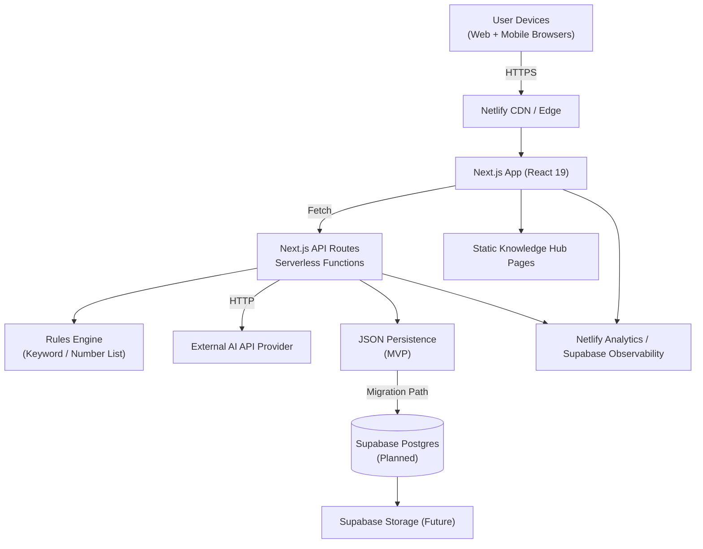

# Prism Fullstack Architecture Document

## 1. Introduction
This document outlines the complete fullstack architecture for **Prism**, combining frontend, backend, and integration design so AI agents can implement the project consistently.

### 1.1 Starter Template or Existing Project
- **Status:** N/A – Greenfield project (no starter repo or template referenced in `docs/prd.md`).

### 1.2 Change Log
| Date       | Version | Description                                  | Author     |
|------------|---------|----------------------------------------------|------------|
| 2025-09-23 | v0.1    | Initial architecture draft (full stack scope) | Architect  |

---

## 2. High Level Architecture

### 2.1 Technical Summary
Prism uses a **Next.js 15** monorepo to deliver both the responsive UI and backend API routes, deployed on **Netlify** with edge-enabled static delivery and serverless functions. The frontend leverages **React 19**, **TypeScript**, **UntitledUI**, and **Zustand**, while backend analysis combines deterministic rule checks with an external AI provider, persisting results in JSON during MVP and migrating to **Supabase Postgres** later. Submissions flow through hardened API routes that enrich results with explanations, suggested actions, and audit events before storage. Netlify manages secrets and previews, and Supabase provides the managed database/auth path once scale demands it. This architecture directly supports PRD goals around sub-three-second analysis, community reporting, and explainable guidance.

### 2.2 Platform and Infrastructure Choice
**Platform:** Netlify + Supabase

**Key Services:**
- Netlify CDN/Edge, serverless functions, environment secret management, analytics
- Supabase Postgres (future migration), Auth (future option), Storage, Observability

**Deployment Regions:** Netlify Global Edge (primary), Supabase `us-east-1` (planned)

### 2.3 Repository Structure
- **Structure:** Monorepo (single `apps/web/` Next.js app)
- **Monorepo Tool:** npm workspaces (no Nx/Turborepo initially)
- **Package Organization:**
  - `apps/web/` – UI + API routes
  - `packages/shared/` – Shared TypeScript models/constants
  - `packages/workflows/` – (Future) agent prompt helpers
  - `configs/` – ESLint, Jest, Tailwind, Playwright configs
  - `infrastructure/` – Netlify config, Supabase migrations
  - `data/` – JSON persistence for MVP

### 2.4 High Level Architecture Diagram

### 2.5 Architectural Patterns
- **BFF (Backend-for-Frontend):** Next.js API routes co-located with UI – _Rationale:_ Simplifies MVP, reduces latency.
- **Hybrid Rule + AI Enrichment:** Deterministic rule evaluation precedes AI inference – _Rationale:_ Provides explainable baseline and predictable cost.
- **Monorepo with Shared Types:** `packages/shared/` houses TypeScript models – _Rationale:_ Prevents drift between UI and API contracts.
- **Progressive Data Strategy:** JSON persistence with planned Supabase migration – _Rationale:_ Accelerates MVP while documenting path to managed SQL.
- **Serverless-first Deployment:** Netlify functions handle risk analysis – _Rationale:_ Automatically scales, matches sub-three-second SLA target.

---

## 3. Tech Stack

| Category | Technology | Version | Purpose | Rationale |
| --- | --- | --- | --- | --- |
| Frontend Language | TypeScript | 5.0.x | Type-safe development across UI and API routes | Already in repo (`package.json`); shared types aid AI agents. |
| Frontend Framework | Next.js | 15.5.3 | Host UI + API routes | Matches project scaffold; works with Netlify functions. |
| UI Component Library | UntitledUI | latest tokens | Trust-centric UI | Required by PRD. |
| State Management | Zustand | 5.0.8 | Lightweight store for analysis/reporting flows | Included dependency; simple for MVP. |
| Backend Language | TypeScript | 5.0.x | Shared type safety for serverless functions | Aligns backend with frontend models. |
| Backend Framework | Next.js API Routes | 15.5.3 | API endpoints | Leverages existing app, low infra overhead. |
| API Style | REST (JSON) | N/A | Expose analysis/report endpoints | Matches PRD acceptance criteria. |
| Database | JSON → Supabase Postgres | MVP JSON; Supabase 15.x planned | Persist submissions, reports, knowledge | Fast MVP, documented migration.
| Cache | Netlify Edge caching + in-memory | N/A | Reduce repeated AI/rule calls | Edge caching for knowledge; memoize rules. |
| File Storage | Netlify assets → Supabase Storage | N/A | Knowledge assets & future uploads | Current assets hosted with Netlify; Supabase for future evidence. |
| Authentication | Netlify Identity (optional) → Supabase Auth | N/A | Moderation/auth flows | Keep MVP simple; upgrade later. |
| Frontend Testing | Testing Library + Jest | 30.1.3 | Component & integration tests | Matches dependencies, ensures UI quality. |
| Backend Testing | Jest | 30.1.3 | Validate rule engine & API | Same tooling across stack. |
| E2E Testing | Playwright | 1.48.x | Full flow validation | CI-friendly; add dependency. |
| Build Tool | Turbopack | 15.5.3 | Dev/build pipeline | Default Next.js choice. |
| Bundler | Turbopack | 15.5.3 | Bundle client/server assets | No extra config needed. |
| IaC Tool | `netlify.toml` + Supabase CLI | N/A | Manage deploy settings & DB migrations | Minimal overhead; scales later. |
| CI/CD | Netlify Deploy Hooks + GitHub Actions | N/A | Automated testing & previews | Netlify handles deploys; GH Actions runs tests. |
| Monitoring | Netlify Analytics → Supabase Observability | N/A | Track usage & performance | Basic metrics now, deeper with Supabase. |
| Logging | Netlify function logs + Supabase log drain | N/A | API diagnostics & audit trail | Provides short-term logging; scales later. |
| CSS Framework | Tailwind CSS | 4.0.x | Styling with UntitledUI tokens | Already configured. |

### 3.2 Responsive Strategy (from UX Spec)
- **Breakpoints:** Adopt the UX-defined tiers (Mobile ≤599px, Tablet 600–1023px, Desktop 1024–1439px, Wide ≥1440px). Codify these in Tailwind config and UntitledUI tokens so AI agents have a single source of truth.
- **Layout Adaptations:** Default to stacked column layouts on Mobile, two-column analysis/tips layout on Desktop+, and widen knowledge hub content on Wide screens. Component documentation in `docs/front-end-spec.md §8` governs when to collapse panels or defer data fetching.
- **Navigation Behavior:** Promote hamburger/overlay navigation on Mobile while keeping persistent header links on Desktop, matching UX guidance to preserve trust cues.

---

## 4. Data Models
Detailed in the Data Models section (Submission, AnalysisResult, ScamReport, KnowledgeBaseEntry, ModerationEvent) with shared TypeScript interfaces and relationships.

---

## 5. API Specification
OpenAPI 3.0 definition covering `/analysis`, `/reports`, `/knowledge`, and `/health` endpoints, including schemas and future security TODOs (pending PRD updates).

---

## 6. Components
- Inventory of backend services (API controllers, repositories, rule engine, AI provider) and frontend components (analysis UI, reporting wizard, knowledge hub).
- Mermaid component diagram illustrating dependencies between UI, services, repositories, JSON/Supabase storage, and external APIs.

---

## 7. External APIs
- **AI Risk Analysis API:** Adapter around external provider (OpenAI/Anthropic), handles prompt versioning and latency logging.
- **Supabase REST/SQL API:** Future migration target for Postgres, auth, storage.
- **Netlify Analytics API:** Monitoring option for previews/production.

---

## 8. Core Workflows
Sequence diagrams for the main user journeys:
1. Submitting a message/phone number and retrieving analysis results.
2. Filing a community scam report and flowing through moderation to rule updates.

---

## 9. Database Schema
Postgres schema (Supabase-ready) with enums, tables, indexes, and notes on JSON compatibility for MVP. Highlights pending data retention/privacy requirements from `docs/prd.md` Appendix A.

---

## 10. Frontend Architecture

### 10.1 Component System Alignment
- **Source of Truth:** Use UntitledUI primitives, extended with Prism-specific components defined in `docs/front-end-spec.md §5` (`RiskScoreCard`, `ActionList`, `SafetyTipCard`). Document props and variants in `packages/shared/ui` so frontend and Storybook stay synchronized.
- **Composition Patterns:** Keep hero/result views as layout shells that compose the above components plus shared utilities (e.g., `SuggestedActionList`, `SignalsAccordion`). AI agents should always reach for these abstractions before reinventing raw Tailwind blocks.

### 10.2 Accessibility Implementation
- **WCAG 2.1 AA:** Enforce spec-defined contrast ratios, focus rings, and aria-live regions (see `docs/front-end-spec.md §7`). The design tokens must expose accessible color ramps and typography defaults to keep compliance automatic.
- **Interaction Guards:** Keyboard-first navigation, skip links, and semantic headings become lint rules (eslint-plugin-jsx-a11y) plus Storybook accessibility checks. Incorporate these requirements into component acceptance criteria.

### 10.3 Responsiveness & Layout Behavior
- **Shared Breakpoints:** Mirror `§8 Responsiveness Strategy` from the UX spec in Tailwind configuration and Zustand selectors. Provide helper utilities (e.g., `useBreakpointValue`) to keep AI-authored code consistent.
- **Content Priority:** Maintain above-the-fold placement for the risk score/action list at Mobile sizes; lazily hydrate heavier explanation/knowledge modules below the fold to protect performance budgets.

### 10.4 Performance Guardrails
- **Dynamic Imports:** Load optional panels (knowledge tips, moderator widgets) with `next/dynamic` and suspense fallbacks to stay within the sub-2.5s FCP target from the UX spec.
- **Web Vitals Monitoring:** Instrument `reportWebVitals` to track CLS/LCP tied to component loads; surface metrics via Netlify analytics dashboards.
- **Caching & Memoization:** Use SWR/React Query or simple memo hooks to cache AI/rule responses during a session. Ensure storybook docs capture these expectations.

---

## 11. Backend Architecture
- Next.js API route structure (`app/api/*`).
- Service/repository layout in `apps/web/lib/`.
- Placeholder auth flow (Netlify secret now, Supabase/Identity later).

---

## 12. Unified Project Structure
Tree layout describing directories for apps, shared packages, configs, infrastructure, scripts, data, and documentation.

---

## 13. Development Workflow
- Prerequisites, setup commands, and shared scripts (`pnpm dev`, `pnpm test`, etc.).
- Environment variable templates for frontend, backend, and shared secrets.

---

## 14. Deployment Architecture
- Netlify deploy strategy, CI pipeline skeleton, and environment table for dev/staging/prod.

---

## 15. Security & Performance
- Initial security controls (CSP, rate limiting, input validation).
- Performance targets (response time, caching strategies, bundle size).
- TODOs for unresolved PRD blockers (KPIs, compliance posture).

---

## 16. Testing Strategy
Testing pyramid, directory organization, and sample tests (component, API, E2E) using Jest/Testing Library/Playwright.

---

## 17. Coding Standards
Critical rules for AI agents (shared types, service usage, env access, error handling) and naming conventions for components, hooks, routes, and database tables.

---

## 18. Error Handling Strategy
Mermaid error flow diagram, API error format, frontend error handler, and backend error helper.

---

## 19. Monitoring & Observability
Initial monitoring plan (Netlify Analytics, Supabase observability, structured logs) with TODO for deeper tooling once KPIs/security posture are finalized.

---

## 20. Outstanding TODOs (Blocked by PRD Updates)
- Document business KPIs and MVP validation plan.
- Define security/compliance posture, data retention, and auth model.
- Flesh out data/integration/operational requirements.
- Specify stakeholder alignment plan and moderation roles.
- Once resolved, update this architecture accordingly and rerun the architect checklist.

### 20.1 Architect Checklist Follow-ups
- **Section 1.1 – Edge-Case Resilience:** Describe explicit fallbacks for AI outages and Supabase downtime, including graceful degradation paths.
- **Section 1.2 – Compliance & Reliability:** Capture privacy/compliance controls, reliability targets, and recovery expectations to meet NFRs.
- **Section 1.3 – Third-Party Constraints:** Document provider limits (AI/Supabase) and Netlify infrastructure constraints once PRD details land.
- **Section 2.1 – Deployment Context Diagram:** Add a container-level or deployment-oriented diagram clarifying where components run.
- **Section 3.1 – Technology Decisions:** Lock UntitledUI versioning and note alternative evaluations for critical stack choices.
- **Section 3.2 – Responsive Strategy:** Outline Tailwind/UntitledUI responsive guidelines, including breakpoint usage.
- **Section 3.3 – Auth & Scaling:** Finalize authentication approach, session handling, and scaling mitigations when PRD security items close.
- **Section 3.4 – Backup & Restore:** Provide database backup, restore, and migration rollback plans for Supabase.
- **Section 4.4 – Authenticated Requests:** Update frontend service guidance once auth tokens/cookies flow is defined.
- **Section 4.5 – Route Protection & Deep Links:** Document moderation route guards and knowledge deep-link expectations.
- **Section 4.6 – Frontend Performance:** Add practices for dynamic imports, web vitals monitoring, and performance budgets.
- **Section 5.1 – Retry & Recovery:** Specify retry/backoff policies, circuit breakers, and recovery steps for external dependencies.
- **Section 5.2 – Monitoring & Alerting:** Define KPIs, dashboards, and alert thresholds aligned with forthcoming business metrics.
- **Section 5.3 – Scaling Limits:** Capture AI throughput assumptions and Supabase scaling guidance once metrics are set.
- **Section 5.4 – Rollback & IaC:** Document Netlify rollback steps and expand infrastructure-as-code coverage for migrations/configs.
- **Section 6.1 – Authentication & Authorization:** Provide full RBAC model, session strategy, and moderator access controls.
- **Section 6.2 – Data Security:** Add encryption policies, data retention schedules, and privacy/PII handling requirements.
- **Section 6.3 – API Security:** Specify rate limits, throttling parameters, and CSRF mitigation tactics.
- **Section 6.4 – Infrastructure Security:** Include Supabase RLS policies, least-privilege guidelines, and network considerations.
- **Section 7.2 – Performance & Security Testing:** Extend testing strategy with load, performance, and security scanning expectations.
- **Section 7.3 – Visual & Fixture Testing:** Add guidance for visual regression tooling and fixture management for frontend tests.
- **Section 7.5 – Documentation & ADRs:** Clarify expectations for ADRs and code-level documentation standards.
- **Section 8.1 – Dependency Maintenance:** Outline dependency review cadence, licensing considerations, and integration fallbacks.
- **Section 8.2 – Internal Dependency Guards:** Note lint or tooling to prevent circular imports and shared package version drift.
- **Section 8.3 – Third-Party Error Handling:** Define retry/backoff behavior and rate-limit handling for each external API.
- **Section 9.4 – Self-Healing Hooks:** Incorporate retry/backoff guidance into error-prevention strategy once resilience work is complete.
