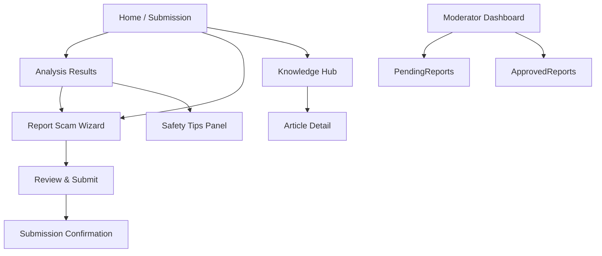
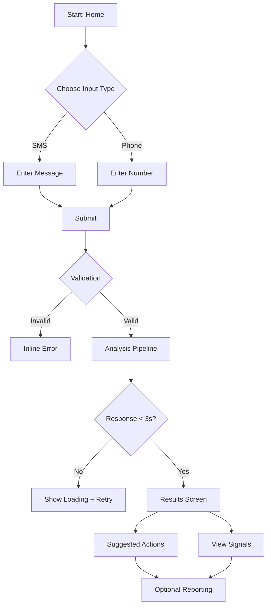
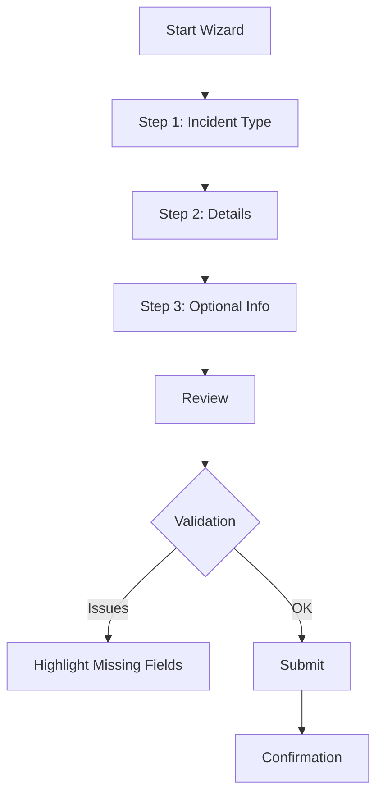
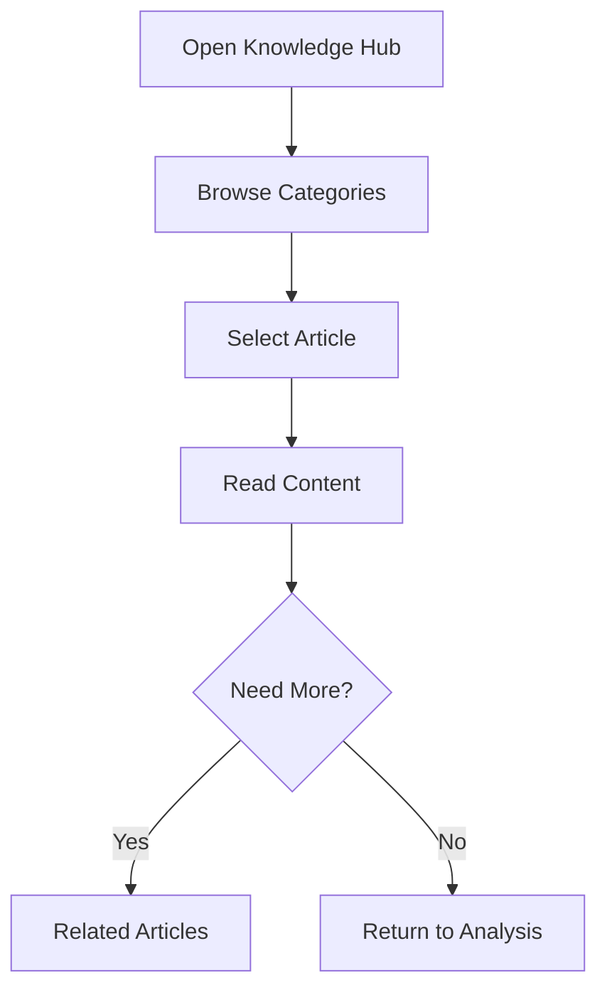

# Prism UI/UX Specification

## 1. Introduction
This document defines the user experience goals, information architecture, user flows, and visual design specifications for Prism's user interface. It serves as the foundation for visual design and frontend development, ensuring a cohesive and user-centered experience.

### 1.1 Overall UX Goals & Principles

#### Target User Personas
- **Cautious Consumer:** Everyday users facing suspicious SMS or robocalls who need instant clarity and reassurance.
- **Caregiver / Advocate:** Individuals supporting vulnerable users (e.g., seniors) who require guidance they can confidently recommend.
- **Moderator / Operator:** Internal staff reviewing community reports and maintaining data quality.

#### Usability Goals
- Provide a submission-to-result experience that a first-time user can complete in under one minute.
- Ensure returning users can resubmit a suspicious message without needing onboarding or help content.
- Deliver clear validation and recovery paths for invalid inputs or integration failures.
- Support moderators with efficient review workflows that surface decision context in two clicks or less.

#### Design Principles
1. **Transparency First** – Explain analysis outcomes with clear, human language and cite contributing factors.
2. **Reassuring Guidance** – Pair every risk score with next steps that reduce anxiety and encourage safe action.
3. **Accessible by Default** – Meet WCAG AA for colors, typography, keyboard access, and screen readers.
4. **Progressive Disclosure** – Start simple; reveal advanced context (AI reasoning, rule hits) only when requested.
5. **Consistency Across Touchpoints** – Reuse patterns, components, and tone whether users submit, learn, or report.

### 1.2 Change Log
| Date       | Version | Description                 | Author |
|------------|---------|-----------------------------|--------|
| 2025-09-24 | v0.1    | Initial front-end spec draft | UX     |

## 2. Information Architecture (IA)

**Primary Navigation:** Header links to `Analyze`, `Knowledge Hub`, `Report a Scam`, plus a persistent call-to-action button (“Check Message/Number”).

**Secondary Navigation:** Contextual tabs within results (e.g., `Overview`, `Signals`, `Actions`, `Tips`) and wizard stepper controls during reporting.

**Breadcrumb Strategy:** Linear breadcrumbs for the reporting wizard and knowledge hub (e.g., `Knowledge Hub / Phishing / SMS Spoofing`).

## 3. User Flows

### 3.1 Suspicious Content Analysis
**User Goal:** Determine if a text or phone number is risky and understand why.

**Entry Points:** Home submission widget, header call-to-action, bookmark.

**Success Criteria:** Risk score, explanation, and recommended actions displayed; user feels confident in next step.

- **Edge Cases & Error Handling:**
  - Invalid input formats trigger inline messaging and focus management.
  - AI provider timeout shows neutral messaging with retry and manual safety link.
  - Re-submission throttled with notice if repeated rapidly.
- **Notes:** Detailed logging captures latency, validation errors, and retries for UX telemetry.

### 3.2 Community Reporting Wizard
**User Goal:** Contribute scam details without exposing personal information.

**Entry Points:** Results screen CTA, global navigation, confirmation pages.

**Success Criteria:** Report captured with category, sanitized content, and user sees confirmation of contribution.

- **Edge Cases & Error Handling:**
  - Partial exits trigger unsaved changes modal (future enhancement).
  - Sensitive info flagged with inline tooltips and sanitization rules.
  - Token-based moderation access ensures only authorized reviewers see data.
- **Notes:** Capture step completion rates for future wizard optimizations.

### 3.3 Knowledge Hub Exploration
**User Goal:** Learn preventative tactics related to recent scam encounters.

**Entry Points:** Results sidebar, header navigation, follow-up emails (future).

**Success Criteria:** User finds relevant article, internalizes tips, optionally shares or bookmarks content.

- **Edge Cases & Error Handling:**
  - Article fetch failure displays fallback message with retry.
  - Outdated content flagged by moderation to maintain trust.
- **Notes:** Map article metadata to risk tiers for contextual recommendations.

## 4. Wireframes & Mockups
- **Primary Design Files:** _Figma project pending — create `Prism_UI_Exploration` once visual exploration begins._

### 4.1 Key Screen Layouts

#### Home / Submission
**Purpose:** Collect SMS text or phone number with clear instructions.

**Key Elements:**
- Input selector (SMS vs Phone).
- Large text area / phone input with validation state.
- Primary CTA “Analyze Now”.

**Interaction Notes:** Auto-focus, input masking for numbers, inline error popovers.

**Design File Reference:** _TBD_

#### Analysis Results
**Purpose:** Convey risk score, explanation, and actions.

**Key Elements:**
- Risk badge with score + qualitative label.
- Factors panel (rule hits, AI rationale).
- Suggested actions list with icons.
- Safety tips drawer.

**Interaction Notes:** Expand/collapse for detailed signals, copy/share actions.

**Design File Reference:** _TBD_

#### Reporting Wizard
**Purpose:** Gather structured report data with minimal friction.

**Key Elements:**
- Stepper with progress indicator.
- Structured fields (message, number, category, notes).
- Inline sanitization feedback.

**Interaction Notes:** `Next` disabled until required fields pass validation; descriptive tooltips.

**Design File Reference:** _TBD_

#### Knowledge Hub
**Purpose:** Enable browsing and reading of safety content.

**Key Elements:**
- Category filters.
- Card grid of articles with risk tags.
- Article detail layout with callouts.

**Interaction Notes:** Server-rendered for SEO, context-based recommendations.

**Design File Reference:** _TBD_

## 5. Component Library / Design System
- **Design System Approach:** Leverage UntitledUI as the baseline, applying Prism-specific tokens (colors, typography) and expanding with custom layouts for analysis components.

### 5.1 Core Components

#### RiskScoreCard
**Purpose:** Display numeric score with qualitative badge.

**Variants:** Compact (sidebar), Full (hero banner).

**States:** Low, Medium, High risk color modes.

**Usage Guidelines:** Always pair with context copy; show updated timestamp.

#### ActionList
**Purpose:** Present recommended steps tailored to risk level.

**Variants:** Inline list, expandable accordions.

**States:** Default, in-progress (if user marks done), disabled (future roadmap).

**Usage Guidelines:** Limit to 3–5 actions; ensure accessible icon/text contrast.

#### SafetyTipCard
**Purpose:** Surface educational content with optional links.

**Variants:** Inline result panel, knowledge hub card.

**States:** Default, featured, dismissed (future personalization).

**Usage Guidelines:** Provide summaries <160 characters; include alt text for imagery.

## 6. Branding & Style Guide

### 6.1 Visual Identity
- **Brand Guidelines:** _Pending — coordinate with marketing once assets exist._

### 6.2 Color Palette
| Color Type | Hex Code | Usage |
|------------|----------|-------|
| Primary | `#2E5A8C` | CTAs, primary navigation, highlights |
| Secondary | `#4CA6A3` | Secondary actions, decorative accents |
| Accent | `#F6C343` | Notifications, educational callouts |
| Success | `#2E8B57` | Positive confirmations |
| Warning | `#E68A00` | Cautionary notices |
| Error | `#C94C4C` | Errors, destructive confirmations |
| Neutral | `#1F2933` / `#E4E7EB` | Text, borders, backgrounds |

### 6.3 Typography
- **Primary:** Inter
- **Secondary:** Source Sans Pro
- **Monospace:** JetBrains Mono

| Element | Size | Weight | Line Height |
|---------|------|--------|-------------|
| H1 | 36px | 600 | 44px |
| H2 | 28px | 600 | 36px |
| H3 | 22px | 500 | 30px |
| Body | 16px | 400 | 24px |
| Small | 14px | 400 | 20px |

### 6.4 Iconography
- **Icon Library:** UntitledUI glyph set with custom additions for scam categories.
- **Usage Guidelines:** Pair icons with text labels; avoid color-only distinctions.

### 6.5 Spacing & Layout
- **Grid System:** 12-column responsive grid (72px gutters desktop, 24px mobile).
- **Spacing Scale:** 4px base unit (4, 8, 12, 16, 24, 32, 48, 64).

## 7. Accessibility Requirements
- **Standard:** WCAG 2.1 AA.

**Visual:**
- Contrast ratios ≥ 4.5:1 for text; 3:1 for large text and graphics.
- Persistent focus outline with 2px high-contrast ring.
- Text scaling up to 200% without layout breakage.

**Interaction:**
- Full keyboard navigation with logical tab order.
- Screen reader support for dynamic updates (use `aria-live` for risk results).
- Touch targets ≥ 44px on mobile.

**Content:**
- Alternative text for icons, badges, and illustrative imagery.
- Hierarchical heading structure (`h1`-`h3`) with skip links.
- Descriptive labels and hints on all form inputs; error messaging tied to fields.

**Testing Strategy:** Combine automated scans (Storybook axe, Lighthouse) with manual keyboard/screen-reader passes per release.

## 8. Responsiveness Strategy

| Breakpoint | Min Width | Max Width | Target Devices |
|------------|-----------|-----------|----------------|
| Mobile | 0px | 599px | Phones |
| Tablet | 600px | 1023px | Tablets, small laptops |
| Desktop | 1024px | 1439px | Standard desktops |
| Wide | 1440px | – | Large monitors |

**Layout Changes:** Stack submission inputs vertically on mobile; two-column layout with results + tips on desktop.

**Navigation Changes:** Collapse primary nav into hamburger on mobile; persistent header on desktop.

**Content Priority:** Prioritize risk summary and action list above the fold; defer secondary context to accordions.

**Interaction Changes:** Larger tap targets and simplified animations on mobile to maintain responsiveness.

## 9. Animation & Micro-interactions
- **Motion Principles:** Keep animations under 250ms, use ease-in-out curves, respect reduced-motion preferences.

- **Key Animations:**
  - **Result Reveal:** Fade-in + scale for risk badge (Duration: 200ms, Easing: ease-out).
  - **Accordion Toggle:** Height transition when expanding details (Duration: 180ms, Easing: ease-in-out).
  - **Wizard Transition:** Slide animations between steps with progress indicator pulse (Duration: 220ms, Easing: ease-in).

## 10. Performance Considerations
- **Page Load:** First contentful paint under 2.5s on 3G mobile.
- **Interaction Response:** Risk analysis results render within 300ms after backend response.
- **Animation FPS:** Maintain 60fps; disable heavy effects for reduced-motion preference.

**Design Strategies:** Leverage static rendering for knowledge pages, defer non-critical scripts, minimize large imagery, and reuse cached component states.

## 11. Next Steps

1. Review this spec with PM, engineering, and moderation stakeholders.
2. Create Figma exploration (`Prism_UI_Exploration`) to translate layouts into high-fidelity mocks.
3. Align with front-end architecture team to ensure component library and accessibility specs integrate smoothly.
4. Gather remaining metrics/persona data called out in PRD Appendix A and update this document accordingly.

### 11.1 Design Handoff Checklist
- [ ] All user flows documented
- [ ] Component inventory complete
- [ ] Accessibility requirements defined
- [ ] Responsive strategy clear
- [ ] Brand guidelines incorporated
- [ ] Performance goals established

## 12. Checklist Results
_UI/UX checklist not yet executed; run once visual explorations are complete._
